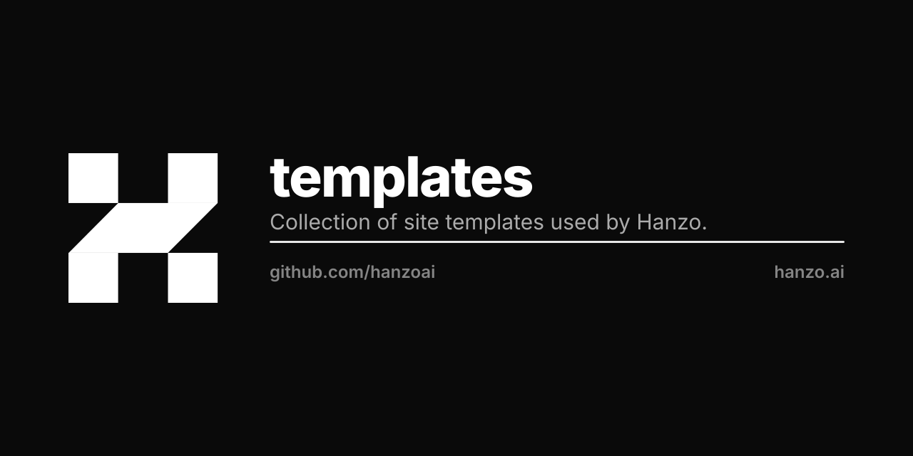

# Hanzo OSS Templates

The one-click open-source catalog for Hanzo Cloud. One static build, served at two hosts:

- **templates.hanzo.ai** — the machine-readable catalog the Hanzo PaaS loads:
  `meta.json` (the app list) + `blueprints/<id>/{template.toml,docker-compose.yml,<logo>}` per app.
- **oss.hanzo.ai** — the human explorer/launcher (`index.html`): search + filter the
  catalog and one-click deploy.

100% static, served by **hanzoai/static** under a strict CSP (`script-src 'self'` — no
inline scripts). No build step, no server.

## One-click deploy

Each card's Deploy CTA deep-links the PaaS:

    https://platform.hanzo.ai/templates?deploy=<id>

`platform.hanzo.ai/templates` reads `?deploy=<id>`, matches it against this same
`meta.json`, and opens the deploy dialog (PaaS `pages/dashboard/templates.tsx`).

## Layout

    index.html        the explorer — hero, search, category filter, card grid
    css/oss.css       theme-aware (light/dark), responsive styles
    js/oss.js         reads meta.json; renders, searches + filters the catalog
    js/theme.js       light/dark bootstrap + toggle (pre-paint, no FOUC)
    meta.json         the catalog: array of {id,name,description,version,logo,links,tags}
    blueprints/<id>/  per-app deploy spec + logo (the PaaS loader reads these)

## Data contract — do not break

The PaaS loader (`platform` → `pkg/platform/src/templates/github.ts`) fetches `meta.json`
and `blueprints/<id>/{template.toml,docker-compose.yml}` from this origin. Keep the
`meta.json` shape and the `blueprints/<id>/` paths stable — the human UI only **reads**
them to render the gallery.
